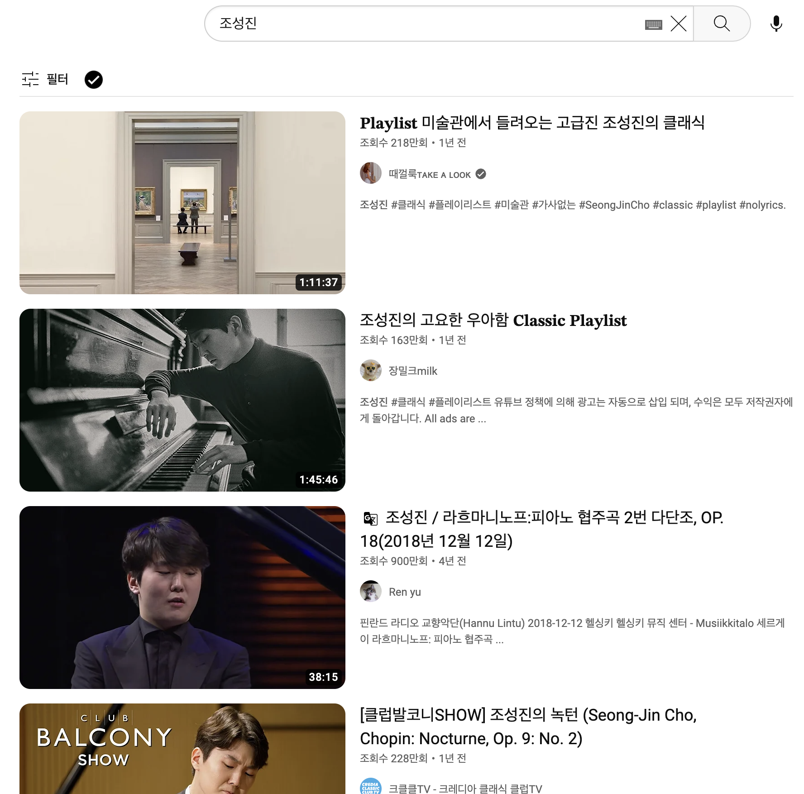
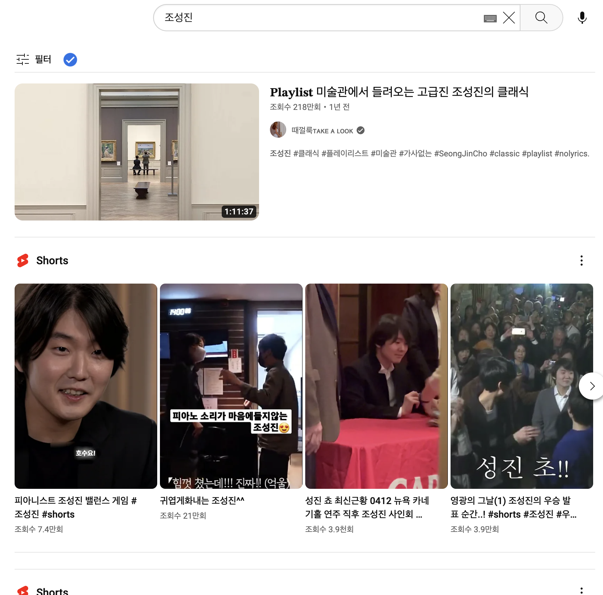
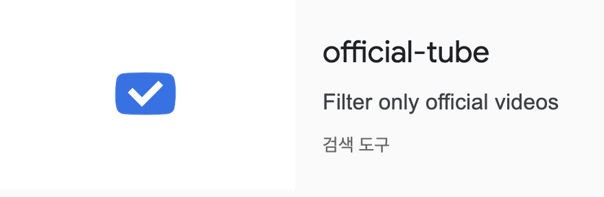

# official-tube

|Disabled|Enabled|
|:-:|:-:|
|||

You can filter youtube videos from officially granted channels by simply clicking the button next to filter menu.

Available at [Chrome Extension Store](https://chrome.google.com/webstore/detail/official-tube/jpcgmkbacpieccbkpkcdejiinbcgnnnf)

    

## What's the purpose of this project?
With [Youtube's Creator Awards program](https://support.google.com/youtube/answer/7682560#zippy=%2Celigibility-criteria%2Credeem-a-youtube-creator-award%2Cshipping-and-delivery), I somewhat felt better as I could filter videos that are not from the original authors. But still I had to watch too much videos that raise eyebrows.

Some might not want to watch disgusting videos although they're from "verified channel"s, or videos that are way too much for noise marketing(i.e., thumbnails are exaggerated or irrelevant, some cases where titles doesn't match the video content.)

And the same applies to Youtube Shorts.

Youtube provides reporting system and we could simply ignore the channel itself or video content, but still chores exist as we have to watch and check the content every time. And there're way too much channels we should report or ignore.

So, I just wanted to rule out those videos for my clean and satisfying Youtube life.

    

## What is "Verified Channel" in Youtube?
> Verified channel represents it's the official channel of a creator, artist, company, or public figure. Verified channels help distinguish official channels from other channels with similar names on YouTube.

    

## Future works
- Filtering Youtube Shorts
- Filtering videos with exaggerated thumbnails

    

## License
[MIT](./LICENSE)